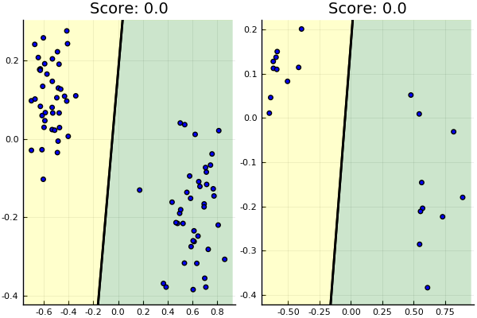
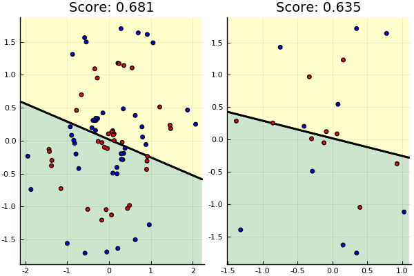
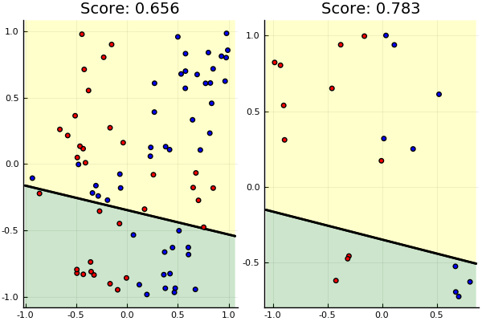
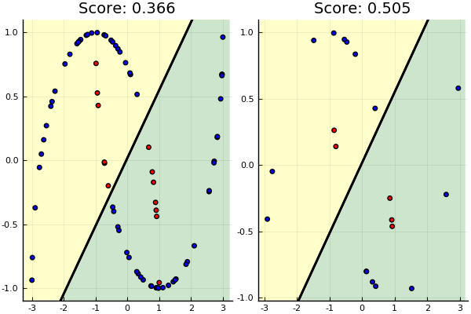

A logistic classifier that now attempts to learn its weights

# Setup

    using Revise
    using Plots
    pyplot()
    
    push!(LOAD_PATH, "../src")
    using Data
    using LogBin

## Generic tester

    function TestData(data)
        cont = DataContainer(data)
        X,y = extractArrays(cont)
    
        class = LogisticClassifierBinary(max_iter=10000)
        initialiseWeights!(class, X)
    
        X_train,y_train, X_test,y_test = trainTestSplit(cont)
    
        fit!(class, X_train, y_train)
    
        plot(plotFit(class, X_train, y_train),
             plotFit(class, X_test, y_test))
    end

# Tests

Each test has an image (left-side) for the training data and its application
to the test data (right-side).

## Blob

    TestData(makeCloud())

## Spiral

    TestData(makeSpiral())

## Xor

    TestData(makeXor())

## Moons

    TestData(makeMoons())

# Old testing ground

    using Logging
    debug_logger = SimpleLogger(stderr, Logging.Debug)
    # global_logger(logger)

    SimpleLogger(IJulia.IJuliaStdio{Base.PipeEndpoint}(IOContext(Base.PipeEndpoint(RawFD(0x00000030) open, 0 bytes waiting))), Debug, Dict{Any,Int64}())

    data = makeCloud()
    cont = DataContainer(data)
    X,y = extractArrays(cont)
    X_train,y_train, X_test,y_test = trainTestSplit(cont)

    '((0.887746 0.910662; -0.115007 -0.413009; … ; 0.840862 0.918078; -0.135662 -0.363429)  (1  0  0  1  1  1  0  0  0  0  …  0  0  0  1  1  0  1  1  1  0)  (0.89045 0.916359; -0.153738 -0.446778; … ; 0.839763 1.00243; -0.124988 -0.407226)  (1  0  1  1  0  1  1  0  1  0  0  0  1  1  0  1  1  1  1  0))

    class = LogisticClassifierBinary()
    #class.max_iter = 5
    #initialiseWeights!(class, X)
    class.w = [0,1]
    class.b = 0
    
    plotFit(class, X, y)

    class.max_iter = 10000
    fit!(class, X_train, y_train)
    
    plotFit(class, X, y)

