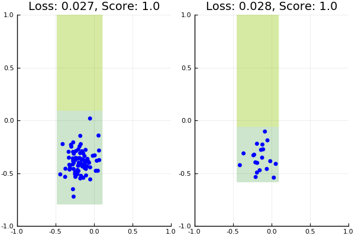

This is the logistic classifier with white noise applied and both L1 and L2 regularisation.

# Setup

    using Revise
    using Plots
    pyplot()
    
    push!(LOAD_PATH, "../src")
    using Data
    using LogBin

## Generic tester

    function TestData(data, λ1=0.5, λ2=0.5)
        cont = DataContainer(data)
        addWhiteNoise!(cont)
        X,y = extractArrays(cont)
    
        class = LogisticClassifierBinary(max_iter=10000, λ1=λ1, λ2=λ2)
        initialiseWeights!(class, X)
    
        X_train,y_train, X_test,y_test = trainTestSplit(cont)
    
        fit!(class, X_train, y_train)
    
        @show class.w
        @show class.b
    
        plot(plotFit(class, X_train, y_train),
             plotFit(class, X_test, y_test))
    end

# Tests

Each test has an image (left-side) for the training data and its application
to the test data (right-side).

## Blob

    data = makeCloud(1)

    '((0.721713 0.29107; 0.701541 0.274586; … ; 0.71161 0.290766; 0.703992 0.286064)  (0  0  0  0  0  0  0  0  0  0  …  0  0  0  0  0  0  0  0  0  0))

First test the normal method

    p = TestData(data, 0., 0.)
    xlims!(-1,1)
    ylims!(-1,1)

    class.w = [-5.26107, -1.76146, 0.0203804]
    class.b = -6.8023650225720615

Now turn on the regularisation and see how the weight parameters are affected.

    TestData(data, 0.5, 0.5)
    xlims!(-1,1)
    ylims!(-1,1)

    class.w = [-1.57788, -0.0615205, 0.0293179]
    class.b = -2.6238820380490133

