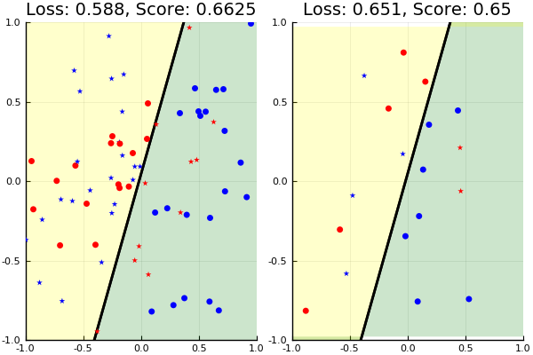

This is the logistic classifier with white noise applied and both L1 and L2 regularisation.

# Setup

    using Revise
    using Plots
    pyplot()
    
    push!(LOAD_PATH, "../src")
    using Data
    using LogBin

# Overlapping blobs

    centres = [[0.2,0.],
             [-0.2,0.]]
    radii = [0.5, 0.5]
    data = makeCloud(centres, radii)
    
     cont = DataContainer(data)
     X,y = extractArrays(cont)
     X_train,y_train, X_test,y_test = trainTestSplit(cont)

First test the normal method

       class = LogisticClassifierBinary(max_iter=10000, λ1=0., λ2=0.)
       initialiseWeights!(class, X)
    
       fit!(class, X_train, y_train)
    
       @show class.w
       @show class.b
    
       plot(plotFit(class, X_train, y_train),
            plotFit(class, X_test, y_test))
    xlims!(-1,1)
    ylims!(-1,1)

    class.w = [-1.89407, 0.731653]
    class.b = -0.035016812552922764

Now turn on the regularisation and see how the weight parameters are affected.

       class = LogisticClassifierBinary(max_iter=10000, λ1=10., λ2=0.5)
       initialiseWeights!(class, X)
    
       fit!(class, X_train, y_train)
    
       @show class.w
       @show class.b
    
       plot(plotFit(class, X_train, y_train),
            plotFit(class, X_test, y_test))
    xlims!(-1,1)
    ylims!(-1,1)

    class.w = [-1.00664, -0.00618968]
    class.b = 0.615944523774552

