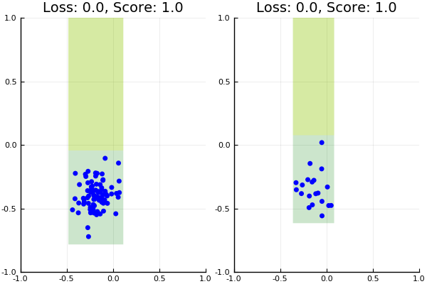
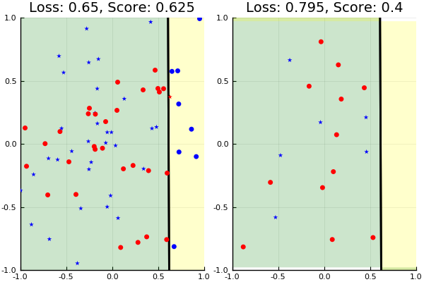

This is the logistic classifier with white noise applied and both L1 and L2 regularisation.

# Setup

    using Revise
    using Plots
    pyplot()
    
    push!(LOAD_PATH, "../src")
    using Data
    using LogBin

## Generic tester

    function TestData(data, λ1=0.5, λ2=0.5)
        cont = DataContainer(data)
        addWhiteNoise!(cont)
        X,y = extractArrays(cont)
    
        class = LogisticClassifierBinary(max_iter=10000, λ1=λ1, λ2=λ2)
        initialiseWeights!(class, X)
    
        X_train,y_train, X_test,y_test = trainTestSplit(cont)
    
        fit!(class, X_train, y_train)
    
        @show class.w
        @show class.b
    
        plot(plotFit(class, X_train, y_train),
             plotFit(class, X_test, y_test))
    end

# Tests

Each test has an image (left-side) for the training data and its application
to the test data (right-side).

## Blob

    data = makeCloud(1)

    '((-0.244686 -0.490033; -0.231836 -0.288295; … ; -0.270935 -0.382341; -0.27438 -0.359204)  (0  0  0  0  0  0  0  0  0  0  …  0  0  0  0  0  0  0  0  0  0))

First test the normal method

    p = TestData(data, 0., 0.)
    xlims!(-1,1)
    ylims!(-1,1)

    class.w = [1.16341, 3.88964, 0.0965111]
    class.b = -9.092417801594474

Now turn on the regularisation and see how the weight parameters are affected.

    TestData(data, 0.5, 0.5)
    xlims!(-1,1)
    ylims!(-1,1)

    class.w = [0.0397076, 0.659898, -0.0386549]
    class.b = -3.3239623585851112

## Overlapping blobs

    radii = [[0.2,0.],
             [-0.2,0.]]
    noises = [0.5, 0.5]
    data = makeCloud(radii, noises)

    '((-0.23614 0.0350279; -0.393309 0.111938; … ; 0.18917 -0.53131; 0.327249 -0.558079)  (0  0  0  0  0  0  0  0  0  0  …  1  1  1  1  1  1  1  1  1  1))

First test the normal method

    p = TestData(data, 0., 0.)
    xlims!(-1,1)
    ylims!(-1,1)

    class.w = [-1.15839, 0.322273, 0.230871]
    class.b = 0.15612352496838766

Now turn on the regularisation and see how the weight parameters are affected.

    TestData(data, 0.5, 0.5)
    xlims!(-1,1)
    ylims!(-1,1)

    class.w = [-1.45749, 0.0429642, -0.273365]
    class.b = -0.19245610904091007

