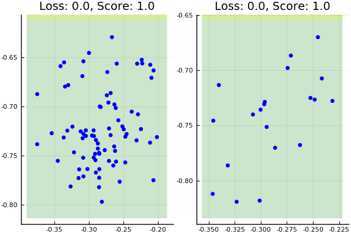
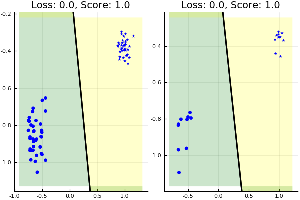
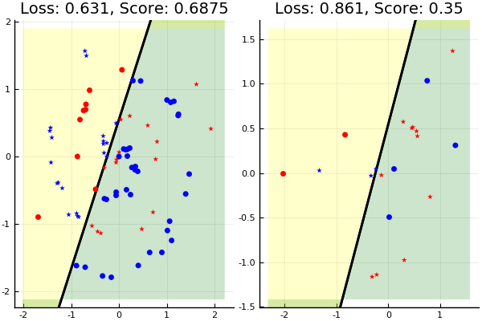
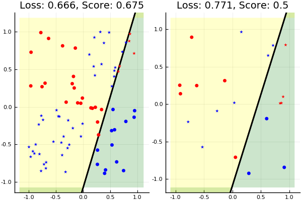
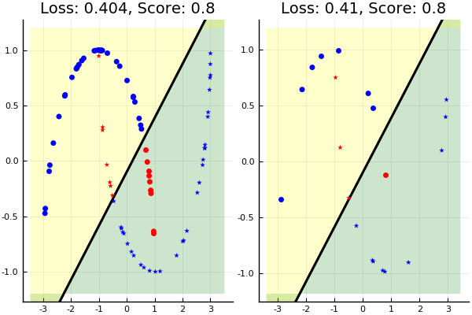

This is the logistic classifier with white noise applied.

# Setup

    using Revise
    using Plots
    pyplot()
    
    push!(LOAD_PATH, "../src")
    using Data
    using LogBin

## Generic tester

    function TestData(data)
        cont = DataContainer(data)
        addWhiteNoise!(cont)
        X,y = extractArrays(cont)
    
        class = LogisticClassifierBinary(max_iter=10000)
        initialiseWeights!(class, X)
    
        X_train,y_train, X_test,y_test = trainTestSplit(cont)
    
        fit!(class, X_train, y_train)
    
        @show class.w
    
        plot(plotFit(class, X_train, y_train),
             plotFit(class, X_test, y_test))
    end

# Tests

Each test has an image (left-side) for the training data and its application
to the test data (right-side).

## One Blob

    TestData(makeCloud(1))

    class.w = [2.13699, 4.48723, 0.0466866]

    class.w = [-5.3139, -1.26413, -0.0345763]

## Blob

    TestData(makeCloud())

    class.w = [12.0451, 3.83459, 0.256395]

## Spiral

    TestData(makeSpiral())

## Xor

    TestData(makeXor())

## Moons

    TestData(makeMoons())

