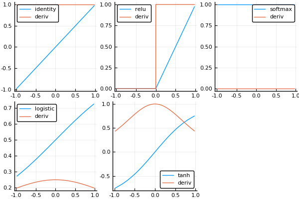

A comparison of the different activation functions and their derivatives.

    using Revise
    using Plots
    pyplot()
    
    push!(LOAD_PATH, "../src")
    using MLBase: ACTIVATIONS, DERIVATIVES

    func_names = collect(keys(ACTIVATIONS))
    
    plist = map(func_names) do name
        plot(ACTIVATIONS[name], -1, 1, label=name)
        plot!(DERIVATIVES[name], -1, 1, label="deriv")
    end
    
    plot(plist...)

