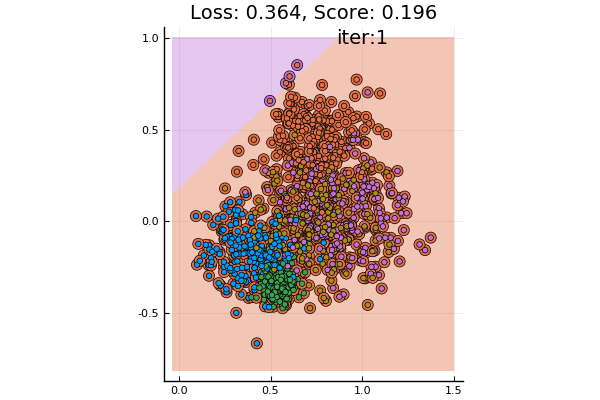
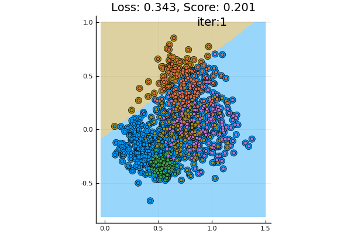
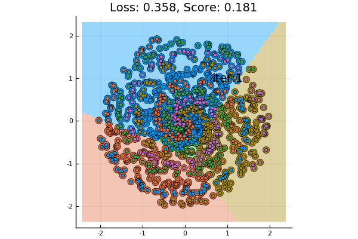
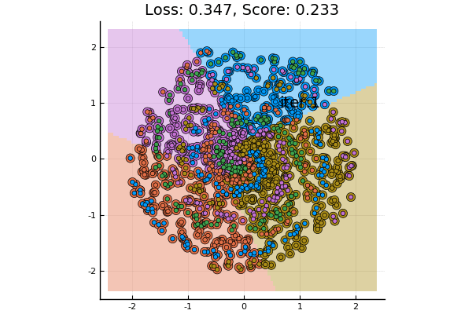
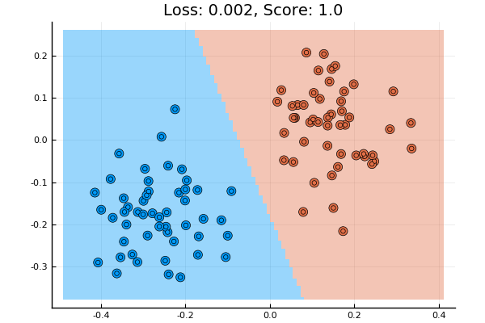

A multinomial classifier

# Setup

    using Revise
    using DanUtils
    using Plots
    pyplot()
    
    push!(LOAD_PATH, "../src")
    using Data
    using LogMult
    using LogBin

# A dumb classifier

## Generic tester

    function TestData(data)
        cont = DataContainer(data...)
    
        class = LogisticClassifierMultinomial(max_iter=10000)
        initialiseWeights!(class, cont)
    
        # plot(class, cont)
        X,y = extractArrays(cont)
        plot(class, X, y)
    end

## Blob

    data = makeCloud(5)
    cont = DataContainer(data...)
    
    class = LogisticClassifierMultinomial()
    initialiseWeights!(class, cont)
    
    X,y = extractArrays(cont)
    y_pred = forwardPass(class, X)
    
    @show y[1,:] y_pred[1,:]
    @show logLoss(y[1,:], y_pred[1,:])
    
    pred = predict(class,X)
    tru = oneHotDec(y)
    
    @show pred tru
    
    nothing

    y[1, :] = Bool[false, true, false, false, false]
    y_pred[1, :] = [0.37501, 0.336744, 0.0493263, 0.197204, 0.0417164]
    logLoss(y[1, :], y_pred[1, :]) = 0.21768648686250164
    pred = [1; 1; 1; 2; 2; 1; 1; 2; 1; 1; 1; 2; 2; 1; 1; 1; 1; 1; 2; 1; 1; 1; 1; 1; 2; 2; 1; 1; 1; 1; 1; 1; 1; 1; 2; 1; 1; 1; 2; 2; 1; 1; 1; 1; 1; 1; 2; 2; 1; 2; 2; 4; 1; 2; 2; 2; 1; 2; 1; 2; 1; 1; 2; 1; 2; 2; 2; 1; 1; 1; 1; 1; 1; 2; 1; 2; 1; 2; 2; 2; 1; 2; 2; 2; 1; 1; 2; 2; 1; 2; 2; 1; 2; 2; 1; 1; 1; 1; 2; 1]
    tru = [2; 4; 2; 3; 3; 2; 5; 1; 5; 2; 2; 1; 1; 2; 2; 5; 2; 5; 1; 5; 4; 5; 2; 5; 3; 1; 5; 5; 4; 4; 5; 2; 4; 4; 3; 4; 2; 5; 1; 1; 2; 4; 4; 2; 4; 4; 3; 1; 5; 3; 3; 1; 4; 3; 3; 3; 2; 3; 4; 1; 4; 5; 3; 5; 3; 1; 1; 4; 2; 5; 2; 4; 2; 1; 4; 3; 2; 1; 1; 3; 5; 3; 1; 1; 4; 5; 3; 1; 4; 3; 3; 5; 3; 1; 2; 5; 5; 4; 1; 2]

    TestData(makeCloud(5))

## Spiral

    TestData(makeSpiral(3, n_samples=1000))

    size(X_back) = (40401, 2)

## Animated spiral

     class = LogisticClassifierMultinomial()
     initialiseWeights!(class, 2, 3)
    
     @show y[1,:] y_pred[1,:]
     @show logLoss(y[1,:], y_pred[1,:])
    
     pred = predict(class,X)
     tru = oneHotDec(y)
    
     @show pred tru
    
     anim = @animate for p = LinRange(0,2π,401)
     @show p
        phases = p*[1, 2, 3]
        data = makeSpiral(phases, n_samples=5000)
        cont = DataContainer(data...)
    
      X,y = extractArrays(cont)
        plot(class, X, y, xlims=[-2.5, 2.5], ylims=[-2.5,2.5])
    end 
    gif(anim, "images/dumb_spiral.gif", fps=10)

# Optimising the fit

    # data = makeSpiral(phases, n_samples=5000)     
    function DoGif(data, plot_filename, λ1=0., λ2=0.)
        cont = DataContainer(data...)
        X,y = extractArrays(cont)
        class = LogisticClassifierMultinomial(max_iter=10, λ1=λ1, λ2=λ2)
        initialiseWeights!(class, cont)
    
        tot_iter = 0
        anim = @animate for n = [fill(1, 20) ; fill(10, 20) ; fill(50, 20) ; fill(200, 20)]
            for i in 1:n
                @printagain @show tot_iter
                fit!(class, X, y)
                tot_iter += 1
            end
            plot(class, X, y, annotate=(1.0,1.0,"iter:$tot_iter"))
        end 
        gif(anim, plot_filename, fps=10)
    end

    DoGif (generic function with 3 methods)

    data = makeCloud(5, n_samples=1000)
    DoGif(data, "images/mult_cloud.gif")
    DoGif(data, "images/mult_cloud_l1l2.gif", 0.05, 0.05)

    data = makeSpiral(5, n_samples=1000)
    DoGif(data, "images/mult_spiral.gif")
    DoGif(data, "images/mult_spiral_l1l2.gif", 0.05, 0.05)

# Comparing binomial vs multinomial

    data = makeCloud(2)
    cont = DataContainer(data...)
    
    cont_bin = DataContainer(data..., conv_one_hot=false)

    DataContainer(100×3 DataFrames.DataFrame
    │ Row │ X1         │ X2         │ y1    │
    │     │ Float64    │ Float64    │ Int64 │
    ├─────┼────────────┼────────────┼───────┤
    │ 1   │ 0.247473   │ -0.0506048 │ 1     │
    │ 2   │ -0.29922   │ -0.144338  │ 0     │
    │ 3   │ 0.0595783  │ 0.0524481  │ 1     │
    │ 4   │ -0.200843  │ -0.143531  │ 0     │
    │ 5   │ 0.0656673  │ 0.0827589  │ 1     │
    │ 6   │ 0.080063   │ 0.0829596  │ 1     │
    │ 7   │ -0.196635  │ -0.095874  │ 0     │
    │ 8   │ 0.292486   │ 0.115077   │ 1     │
    │ 9   │ -0.325655  │ -0.271717  │ 0     │
    │ 10  │ 0.243591   │ -0.0365232 │ 1     │
    ⋮
    │ 90  │ -0.289541  │ -0.226703  │ 0     │
    │ 91  │ 0.0565176  │ 0.0524375  │ 1     │
    │ 92  │ 0.0178673  │ 0.0907     │ 1     │
    │ 93  │ -0.287518  │ -0.0975342 │ 0     │
    │ 94  │ -0.0909624 │ -0.12126   │ 0     │
    │ 95  │ 0.17355    │ -0.216218  │ 1     │
    │ 96  │ -0.339632  │ -0.200565  │ 0     │
    │ 97  │ 0.154941   │ 0.175327   │ 1     │
    │ 98  │ -0.208294  │ -0.0695392 │ 0     │
    │ 99  │ -0.2617    │ -0.183241  │ 0     │
    │ 100 │ 0.114297   │ 0.0425646  │ 1     │, 100, 2, Symbol[:X1, :X2], 1, Symbol[], true, Array{Float64,1}[[1.0, 1.0], [0.0, 0.0]])

    class = LogisticClassifierMultinomial(max_iter=10000)
    initialiseWeights!(class, cont)
    
    X,y = extractArrays(cont)
    
    fit!(class, X, y)
    
    plot(class, X, y)

    class = LogisticClassifierBinary(max_iter=10000)
    
    # plot(class, cont)
    X,y = extractArrays(cont_bin)
    
    initialiseWeights!(class, X)
    
    fit!(class, X, y)
    
    plot(class, X, y, one_hot=false)

