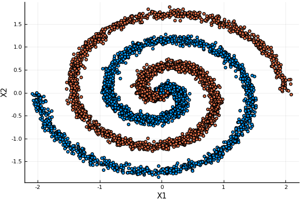
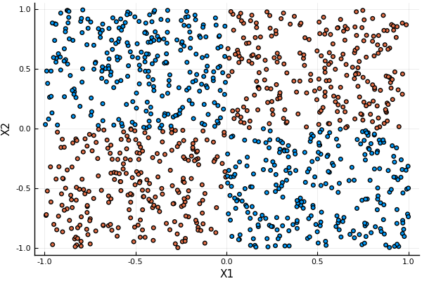

# Table of Contents

1.  [Donut](#org4f12530)
2.  [Cloud](#org15d1cf1)
3.  [Spiral](#org2dfa5c5)
4.  [Xor](#org6796fcf)
    1.  [2D](#org4f74a5e)
    2.  [3D](#org5c9caa7)
5.  [Moons](#orgd145a6b)

    union!(LOAD_PATH, ["../src"])
    using Data

# Donut

    data = makeDonut()
    container = DataContainer(data)
    plot(container)

# Cloud

    data = makeCloud()
    container = DataContainer(data)
    plot(container)

# Spiral

    data = makeSpiral(4, n_samples=5000)
    container = DataContainer(data)
    plot(container)

# Xor

## 2D

    data = makeXor(n_samples=1000)
    container = DataContainer(data)
    plot(container)

## 3D

    data = makeXor(3, n_samples=1000)
    container = DataContainer(data)
    plot(container)

# Moons

    data = makeMoons()
    container = DataContainer(data)
    plot(container)

