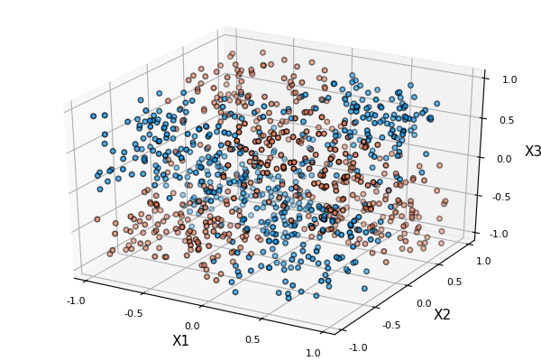

This is a series of tests for the generation of datasets.

    using Revise
    using Plots
    pyplot()
    default(legend=false)

    union!(LOAD_PATH, ["../src"])
    using Data

# Donut

    data = makeDonut()
    container = DataContainer(data)
    plot(container)

    andReversed(x) = [x ; reverse(x)]
    anim = @animate for r2 = andReversed(0:0.1:5)
        data = makeDonut([1.,r2,4.], noise=0.2, n_samples=1000)
        container = DataContainer(data)
        plot(container, xlim=[-6,6], ylim=[-6,6])
    end 
    gif(anim, "images/donut.gif", fps=10)

# Cloud

    data = makeCloud(5)
    container = DataContainer(data)
    plot(container)

# Spiral

    data = makeSpiral(2, n_samples=5000)
    container = DataContainer(data)
    plot(container)

    anim = @animate for p = LinRange(0,2π,101)
          phases = p*[1, 2, 3]
          data = makeSpiral(phases, n_samples=5000)
          container = DataContainer(data)
          plot(container, xlims=[-2.5, 2.5], ylims=[-2.5,2.5])
      end 
      gif(anim, "images/spiral.gif", fps=10)

# Xor

## 2D

    data = makeXor(n_samples=1000)
    container = DataContainer(data)
    plot(container)

## 3D

    data = makeXor(3, n_samples=1000)
    container = DataContainer(data)
    plot(container)

# Moons

    data = makeMoons()
    container = DataContainer(data)
    plot(container)

