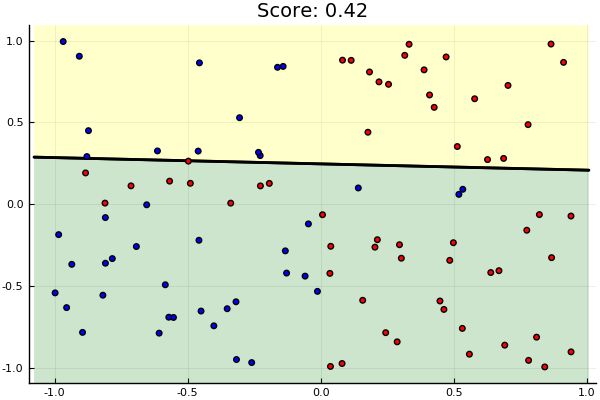

Random weights for classification.

# Setup

    using Revise
    using Plots
    pyplot()
    
    push!(LOAD_PATH, "../src")
    using Data
    using LogBin

## Generic tester

    function TestData(data)
        cont = DataContainer(data)
        X,y = extractArrays(cont)
    
        class = LogisticClassifierBinary()
        initialiseWeights!(class, X)
    
        plotFit(class, X, y)
    end

# Sprial

    TestData(makeSpiral(n_samples=1000))

    TestData(makeCloud())

    TestData(makeDonut())

    TestData(makeXor())

    TestData(makeMoons())

